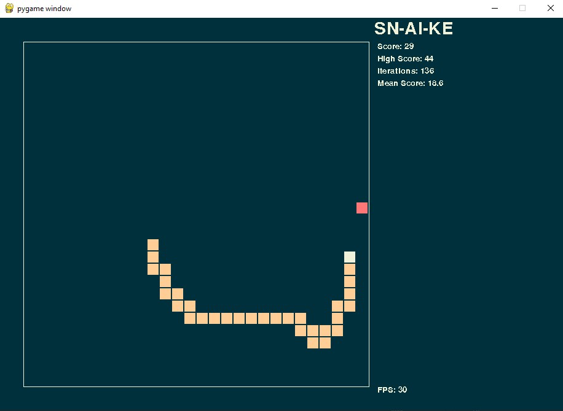

# Snake AI - Deep Q Learning

This project is an AI-powered Snake game where an agent learns to play using **Deep Q-Learning (DQN)**. The AI trains by optimizing its actions to maximize score while avoiding collisions.

## Features
- **Deep Q-Network (DQN)**: Neural network for decision-making.
- **Experience Replay**: Stores game experiences for better learning.
- **Target Network**: Stabilizes training with a secondary network.
- **Epsilon-Greedy Strategy**: Balances exploration vs. exploitation.
- **Pygame Visualization**: Watch the AI play in real-time.
- **Model Saving & Loading**: Continue training from saved checkpoints.



## Installation
### 1. Clone the repository
```sh
git clone https://github.com/yourusername/snake-ai.git
cd snake-ai
```
### 2. Install dependencies
```sh
pip install -r requirements.txt
```
### 3. Run the AI
To train and watch the AI play:
```sh
python snake_ai.py
```

## Project Structure
```
├── brain.py        # Deep Q-Learning model
├── settings.py     # Game & training settings
├── snake_ai.py     # Main game loop & AI control
├── requirements.txt
└── README.md       # Project documentation
```

## Customization
Modify `settings.py` to adjust:
- Learning rate (`LR`)
- Grid size, screen dimensions
- FPS settings
- Model checkpoint path

## Training Process
The AI learns through **reinforcement learning** by playing games and improving based on rewards:
- +50: Eating food
- -20: Colliding with the wall or itself
- Small rewards for moving toward food, penalties for moving away

## Future Improvements
- Implementing convolutional neural networks (CNNs) for better vision-based learning
- Training using external reinforcement learning libraries
- Allowing user-controlled vs. AI matches

## Contributing
Pull requests are welcome! Please open an issue for major changes.

## License
MIT License - Feel free to use and modify!

